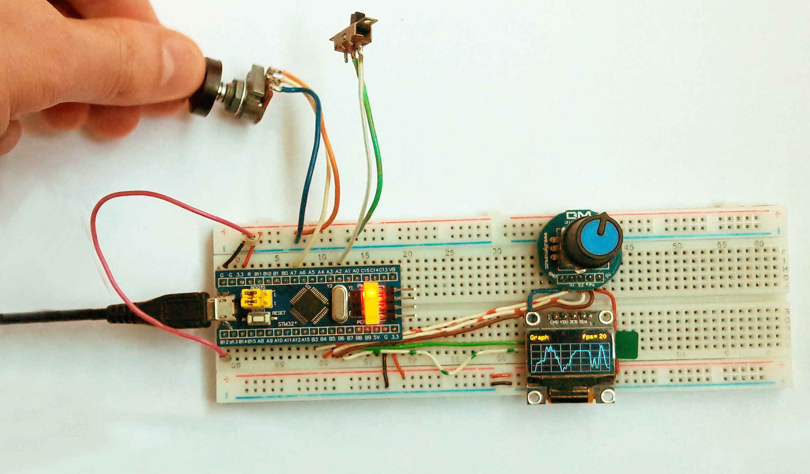

# TestOscilloscope
Pet-project для изучения работы с STM32 контроллерами (плата blue pill), использования энкодеров, отрисовки на OLED-экранчике и других возможностей.

На экране отрисовывается график напряжения на пине, к которому подключен переменный резистор

